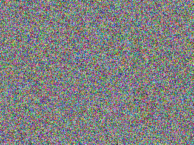

# Noise_map_and_OCR

Noise_map:生成一个噪点图

OCR:利用现有技术识别图片中的文字

本项目目的是想针对含噪声的文字图片进行去杂处理与识别。

### 一、Noise map

首先，我们调用python的PIL库生成一个320x240的空图像（初始为黑），然后对图像每个点进行遍历，每个点的（r,g,b)全部设置成random.randint(0,256)，即\[0,255\]的整数，设置putpixel，最终输出图像（比较简单）:

```python
from PIL import Image
import random
image = Image.new('RGB',(320,240))
for i in range(image.size[0]):
    for j in range(image.size[1]):
        image.putpixel((i,j),(random.randint(0,256),random.randint(0,256),random.randint(0,256)))
image.save(open('noisemap.png','wb'),'png')
```



### 二、OCR

首先，我们调用python的PIL库生成一个320x240的空图像（初始为黑），然后对图像每个点进行遍历，每个点的（r,g,b)全部设置成random.randint(0,256)，即\[0,255\]的整数，设置putpixel，最终输出图像（比较简单）


