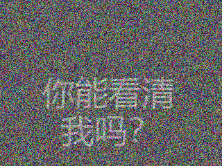

# Noise_map_and_OCR

Noise_map:生成一个噪点图

OCR:利用现有技术识别图片中的文字

本项目目的是想针对含噪声的文字图片进行去杂处理与识别。

### 一、Noise map

首先，我们调用python的PIL库生成一个320x240的空图像（初始为黑），然后对图像每个点进行遍历，每个点的（r,g,b)全部设置成random.randint(0,256)，即\[0,255\]的整数，设置putpixel，最终输出图像（比较简单）:

```python
from PIL import Image
import random
image = Image.new('RGB',(320,240))
for i in range(image.size[0]):
    for j in range(image.size[1]):
        image.putpixel((i,j),(random.randint(0,256),random.randint(0,256),random.randint(0,256)))
image.save(open('noisemap.png','wb'),'png')
```


### 二、生成带杂点的文字

在图像中生成文字需要借助PIL的ImageFont与ImageDraw：

```python
from PIL import Image
from PIL import ImageFont
from PIL import ImageDraw
import random
m=128
image = Image.new('RGB',(320,240))
font = ImageFont.truetype('font.ttf',48)
draw = ImageDraw.Draw(image)
draw.text((60, 100),"你能看清\n  我吗？",(255,255,255),font=font)
image.save(open('font.jpg','wb'),'jpeg')
for i in range(image.size[0]):
    for j in range(image.size[1]):
        image.putpixel((i,j),(random.randint(0,256),random.randint(0,256),random.randint(0,256))
image.save(open('pic.png','wb'),'png')
```

这里的m指的是文字显示程度，在\[0,255\]的范围内，m越大，文字越清晰，杂点越少，显示的效果就越好。

m=16的效果：


感觉字都被隐藏在图片里了

### 三、手动处理带杂点的文字

手动处理带杂点的文字，以使自己的肉眼能接受文字

我们将其黑白化：[黑白化代码](unzippic2.py)：unzippic2.py


肉眼感觉emmm字的清晰度没有什么改变

我们将其二值化：


效果也不是很好。

由于我们的字的图像是以笔画为单位而不是像素，所以对一般的像素点，白色与白色相邻的概率要大于黑白相邻的概率。

因此，像素点的归类可以利用其邻域内的像素点来除杂（我们暂且把这种方法叫作邻近除杂方法）：

```python
def color(i,j,rangee):#返回(i,j)在rangee领域内的所有像素点

    ary=[]
    for ii in range(i-rangee,i+rangee+1):
        for jj in range(j-rangee,j+rangee+1):
            if 0<=ii<WIDTH and 0<=jj<HEIGHT:
                ary.append((ii,jj))
    return ary
def avg(a):#返回像素的判定结果

    b=[0 for _ in range(len(a[0]))]
    for i in a:
        for j in range(len(i)):
            b[j]+=i[j]
    for i in range(len(b)):
        b[i]//=len(a)
    if sum(b)>384:
        return tuple(255 for _ in range(len(b)))
    else:
        return tuple(0 for _ in range(len(b)))
```

r=1：


r=2：


r=3：


r=5：


可以看到有一段时间图像中的字的确是变得清晰了（起码能看出个数）,用一个大一点的图能不能效果更好呢？

代码见unzippic文件夹：

font（1280x960）


加入噪声：


黑白：


r=4：


r=5：


感觉二值化会产生很多杂点，总会有一些点的颜色是错的，干扰了视线。而只使用邻近除杂而不进行二值处理的图片是这样的：（没有对比度）


于是想到用一个func函数的方法来综合原数据和二值化的数据，使得图像既不丢失原数据，又能提高对比度：

```python
def func(i):#i为原图(x,y,z)平均值

    j=0 if i<=120 else 255 if i>=136 else int((i-120)*16)
    return (j,j,j)
```

r=0（即不邻近除杂）效果：


r=5效果：


虽然图像模糊，但是总体效果算是不错的了。

### 四、OCR配置

用既有的文字识别库识别汉字。

使用三种字体：上面用的字体（我也不知道叫什么），宋体，微软雅黑

我在识别的时候，每次把图片都负片处理一下，保证字的灰度大于背景的灰度，然后再进行识别。

结果是微软雅黑识别正确率100%，剩下两种字体识别正确率0%

（emm看来网上python识别汉字的库是用微软雅黑汉字训练的。。。）

[unzip](unzip.py)、[unzip2](unzip2.py)、[unzip3](unzip3.py) 分别对应了三种字体的代码，识别结果分别为result中的[result.txt](结果/result.txt)、[resultsimsun.txt](结果/resultsimsun.txt)、[resultmsyh.txt](结果/resultmsyh.txt)

最后我识别了这个：


出乎意料地[识别结果](结果/articleresult.txt)很好。只有一个！识别成了1,剩下的全部识别正确！

### 五、OCR识别带噪声的文字

首先，生成m=64的带噪声的图像：



先直接识别一下，使用[unzipmsyhwithnoise.py](unzipmsyhwithnoise.py)识别失败了。没有识别结果

我们将视线转到[unzippicmsyh.py](unzippicmsyh.py)文件：

先设置r=0，只进行二值化：


感觉效果不是很好，使用[unzipmodifiedmsyh.py](unzipmodifiedmsyh.py)没识别出任何东西。

设置r=1：


效果非常不错！

最后识别结果（存在resultofmodifiedpic.txt中）：

### 六、总结

至此，通过除杂的操作，成功将一个不能直接识别的图片先预处理再转换成文本。
